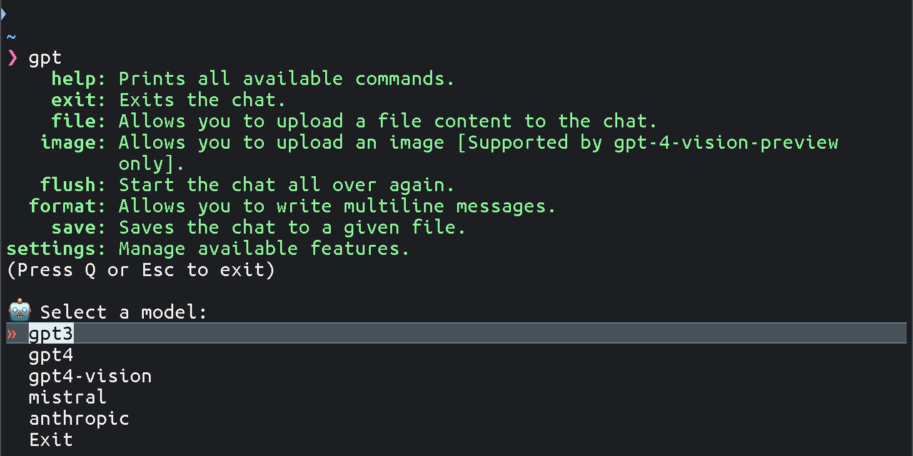
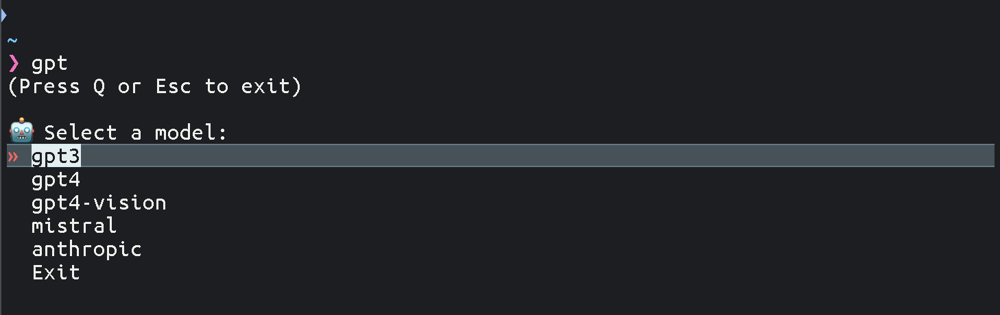
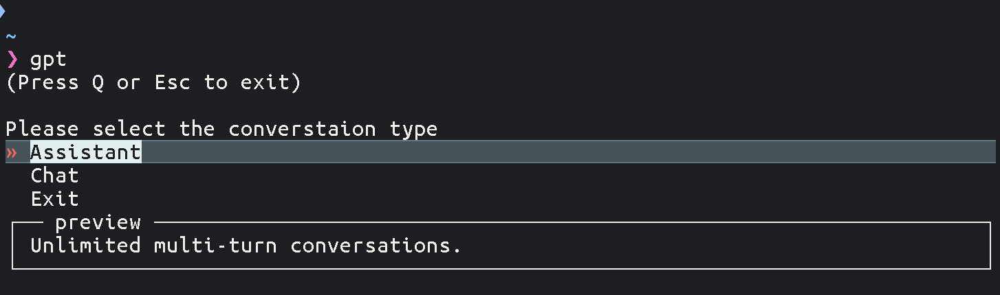

# Welcome to the Examples page

---

1. **Intro message on start up:**
    
   > The intro message is the same as using the `help` command during conversation.

---

2. **Model selection menu:**
   
   > You can use the arrow keys to navigate around the menu. 
   > It also supports "search mode" as in VIM (via /).

---

3. **Conversation type:**
   
   > [Assistant](https://platform.openai.com/docs/assistants/overview?context=with-streaming)   > [Chat](https://platform.openai.com/docs/guides/text-generation)

---

4. **Continue an old chat:**
   
   > No matter which model you use, you can continue your chat with a different one.

---

5. **Role selection:**
   
   > By choosing a role, you are giving the model a set of guidelines as to how it should behave during the conversation.

---

6. **Temperature selection:**
   
   > The temperature determines how accurate the models will be. By default, we've set it to maximum accuracy, which should produce less "creative" results.

---

7. **Help menu:**
   
   > Those are all of the supported built-in commands.

---

8. **Vision by GPT-4 Vision**:
    
    
    

---

### :star: After exploring the examples, you've seen just a glimpse of what console-chat-gpt can do. Now it's time to experience its full potential yourself. :start:
