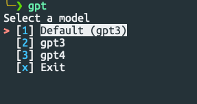
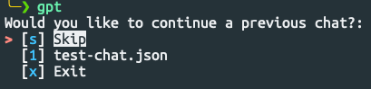
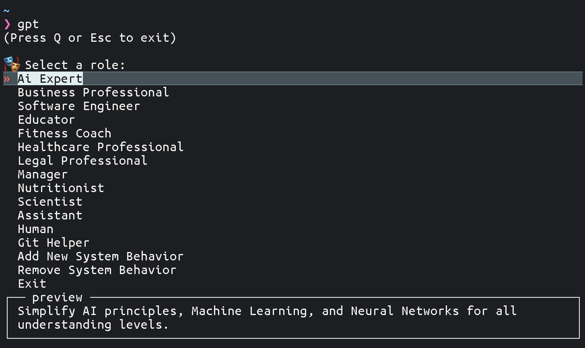
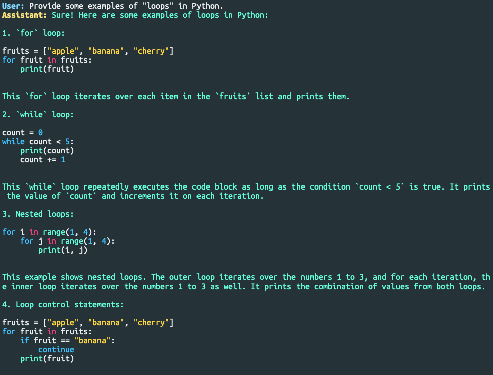
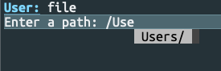
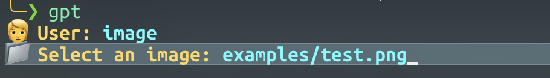
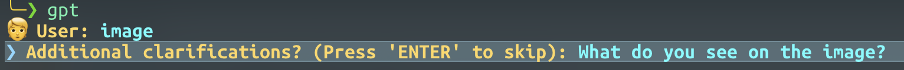
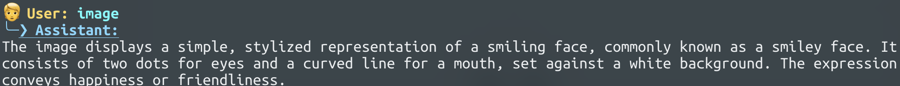

<div align="center">

<h1>

console-chat-gpt v3

</h1>

The ultimate command line interface for chatting with ChatGPT or MistralAI! Save time and effort with this simple yet effective tool.

<h3>

[Homepage](https://github.com/amidabuddha/consoleChatGPT) | [Examples](/examples)

</h3>

 <h4 align="center">
  <a href="https://github.com/amidabuddha/consoleChatGPT/blob/main/LICENSE.md">
  
  </a>
  
  
  
  
  
  
</h4>

</div>

---

# Table of Contents

- [Features](#features)
- [Installation and Usage](#installation-and-usage)
- [Examples and Preview](#examples-and-preview)
- [TODOs](#todos)

---

**DISCLAIMER:**
The intention and implementation of this code are entirely unconnected and unrelated to OpenAI, MistralAI or any other related parties. There is no affiliation
or relationship with OpenAI, MistralAI, or their subsidiaries in any form.

---

## Features

- :star: **OpenAI Assistants Beta** fully supported
- **Configuration File**: Easily customize the app's settings through the `config.toml` file for complete control over
  how the app works. :new: now supported in-app via the "settings" command
- **Role selection**: Users can define the role of the AI in the conversation, allowing for a more personalized and
  interactive experience.
- **Temperature Control**: Adjust the temperature of generated responses to control creativity and randomness in the
  conversation.
- **Command Handling**: The app responds to various commands entered by the user for easy and intuitive interaction.
- **Error Handling**: Clear and helpful error messages to easily understand and resolve any issues.
- **Conversation History**: Review previous interactions and save conversations for future reference, providing context
  and continuity.
- **Graceful Exit**: Smoothly handle interruptions, ensuring conversations are saved before exiting to avoid loss of
  progress.
- **A nice team**: Actively adding features, open for ideas and fixing bugs.

Overall, this app focuses on providing a user-friendly and customizable experience with features that enhance
personalization, control, and convenience.

---

## Installation and Usage

The script should work fine in Linux and macOS terminals. There might be some libraries that are currently not supported
on Windows, the recommended use is inside [WSL](https://learn.microsoft.com/en-us/windows/wsl/)

1. Clone the repository:

   ```shell
   git clone https://github.com/amidabuddha/console-chat-gpt.git
   ```

2. Go inside the folder:

   ```shell
   cd console-chat-gpt
   ```

3. Install the necessary dependencies:

   ```shell
   python3 -m pip install -r requirements.txt
   ```

4. Get your API key from [HERE](https://platform.openai.com/account/api-keys) or [HERE](https://console.mistral.ai/user/api-keys/) depending on your selected LLM

5. The `config.toml.sample` will be automatically copiend into `config.toml` upon first run, with a prompt to enter your API key/s. Feel free to change any of the other defaults thta are not available in hte "settings" in-app menu as per your needs.

6. Run the executable:

   ```shell
   python3 main.py
   ```

   > Pro-tip:
   > Create an alias for the executable to run from anywhere

7. Use the `help` command within the chat to check the available options.

8. Enjoy

---

## Examples and Preview

1. **Upon execution of the script, you'll be prompted to select the model you would like to use:**
   </br>
   > Use arrow keys or keyboard to navigate.
   > The signs/numbers inside the "[]" (e.g. [x]) are the actual keybinds to access the displayed function.


2. **Afterwards, you'll be prompted to continue a previous chat:**
   </br>


3. **Select how the GPT should behave:**
   
   > These roles are set inside your `config.toml`. You can add/remove or adjust them.


4. **Prompt for temperature (GPT randomness):**
   </br>


5. **Help menu with built-in commands:**
   </br>


6. **Language formatting and coloring:**
   </br>
   > [Supported languages](https://pygments.org/languages/)


7. Additional features:
    1. Loading animation when waiting for response:
       </br>
    2. Path completion when using the `file` command:
       </br>
    3. Vision by `gpt-4-vision-preview`:
       </br>
       </br>
       </br>
---

## TODOs

Features that are currently not available in v2 will be soon added, you can keep track of that
at [the TODO List](todo.md)

