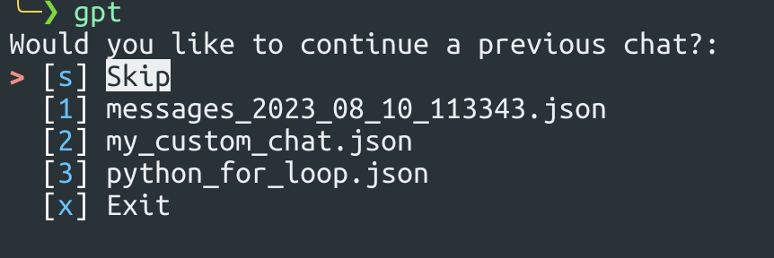
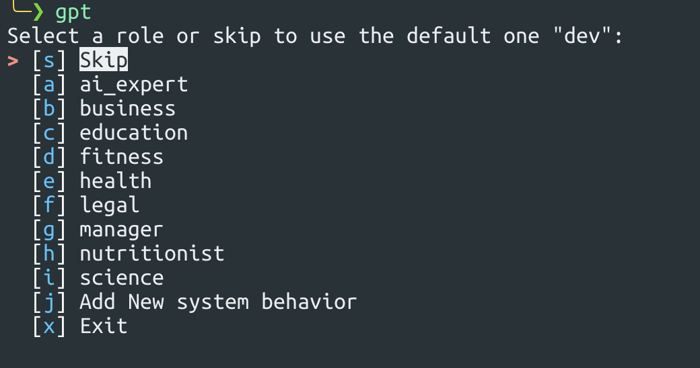
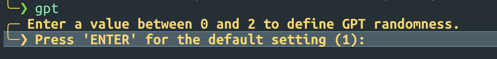
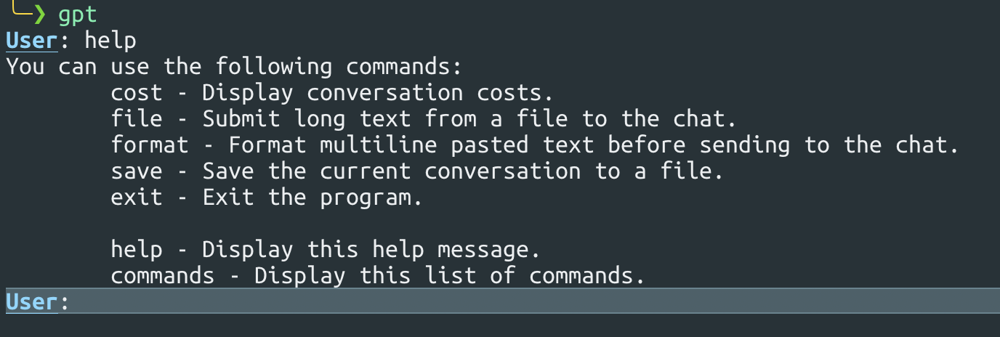
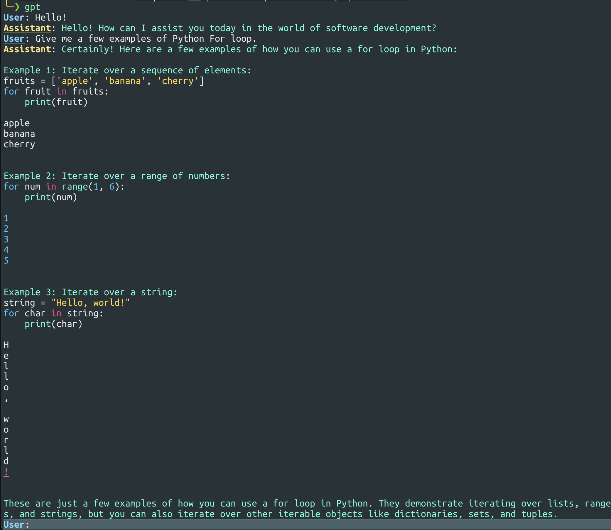

---

<div align="center">

<h1>

console-chat-gpt

</h1>

The ultimate command line interface for chatting with ChatGPT! Save time and effort with this simple yet effective tool.

<h3>

[Homepage](https://github.com/amidabuddha/consoleChatGPT) | [Examples](/examples)

</h3>

 <h4 align="center">
  <a href="https://github.com/amidabuddha/consoleChatGPT/blob/main/LICENSE.md">
  
  </a>
  
  
  
  
  
  
</h4>

</div>

---

# Table of Contents

- [Features](#features)
- [Installation and Usage](#installation-and-usage)
- [Examples and Preview](#examples-and-preview)

---

**DISCLAIMER:**
The intention and implementation of this code are entirely unconnected and unrelated to OpenAI. There is no affiliation or relationship with OpenAI in any form.

---

## Features

- **Configuration File**: Easily customize the app's settings through the `config.toml` file for complete control over how the app works.
- **Role selection**: Users can define the role of the AI in the conversation, allowing for a more personalized and interactive experience.
- **Temperature Control**: Adjust the temperature of generated responses to control creativity and randomness in the conversation.
- **Color Customization**: Personalize the interface by customizing the colors used in the app.
- **Command Handling**: The app responds to various commands entered by the user for easy and intuitive interaction.
- **Error Handling**: Clear and helpful error messages to easily understand and resolve any issues.
- **Conversation History**: Review previous interactions and save conversations for future reference, providing context and continuity.
- **Token Limit Alerts**: Get alerts when approaching the maximum allowed token limit to manage conversation length effectively.
- **Cost Estimation**: Inquire about estimated costs of the chat based on the number of tokens used for better cost management.
- **Graceful Exit**: Smoothly handle interruptions, ensuring conversations are saved before exiting to avoid loss of progress.
- **A nice team**: Actively adding features, open for ideas and fixing bugs.

Overall, this app focuses on providing a user-friendly and customizable experience with features that enhance personalization, control, and convenience.

---

## Installation and Usage

The script should work fine in Linux and macOS terminals. There might be some libraries that are currently not supported on Windows, the recommended use is inside [WSL](https://learn.microsoft.com/en-us/windows/wsl/)

1. Clone the repository:

   ```shell
   git clone https://github.com/amidabuddha/console-chat-gpt.git
   ```

2. Go inside the folder:

   ```shell
   cd console-chat-gpt
   ```

3. Install the necessary dependencies:

   ```shell
   python3 -m pip install -r requirements.txt
   ```

4. Get your API key from [HERE](https://platform.openai.com/account/api-keys)

5. Copy `config.toml.sample` into `config.toml`, replace the text "YOUR_OPENAI_API_KEY" with your API key and save the new config file. Feel free to change any of the other defaults as per your needs.

6. Run the executable:

   ```shell
   python3 chat.py
   ```

   > Pro-tip:
   > Create an alias for the executable to run from anywhere

7. Use the `help` command within the chat to check the available options.

8. Enjoy

---

## Examples and Preview

1. Upon execution of the script, you'll be prompted to continue an old chat:
    
   > Use arrow keys or keyboard to navigate.
   > The signs/numbers inside the "[]" (e.g. [x]) are the actual keybinds to access the displayed function.

2. Select how the AI should behave:
   
   > These roles are set inside your `config.toml`. You can add/remove or adjust them.

3. Prompt for temperature (randomness):
   

4. Help menu with built-in commands:
   

5. Language formatting and coloring:
   
   > [Supported languages](https://pygments.org/languages/)

---
